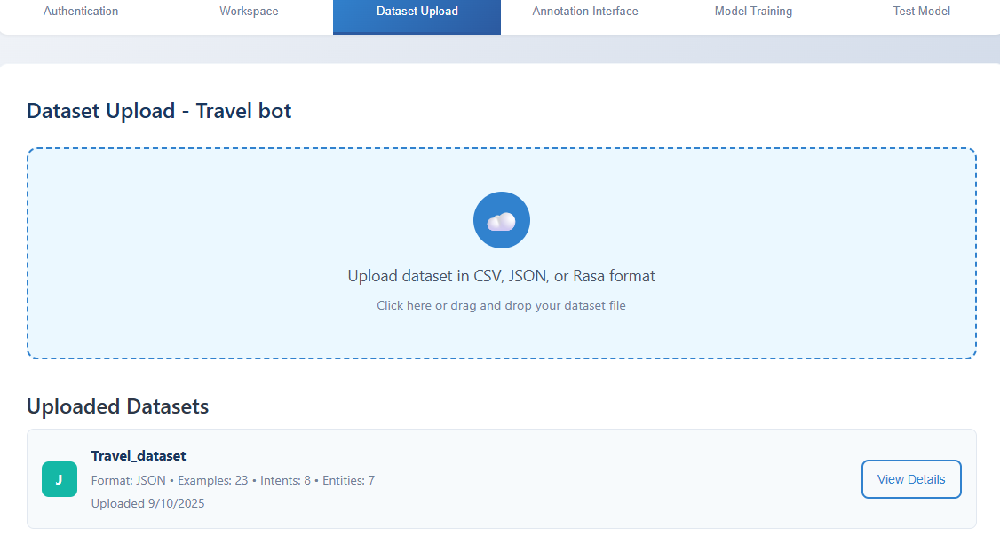
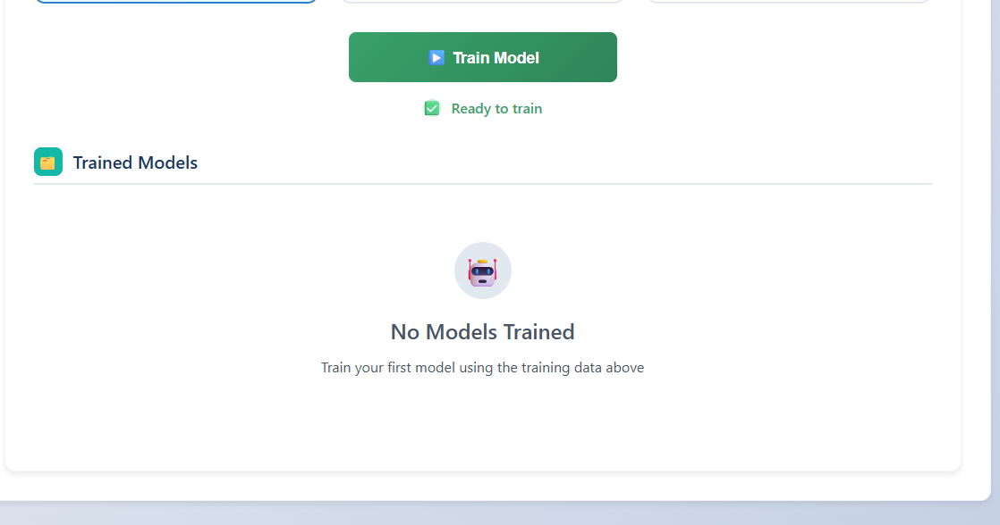
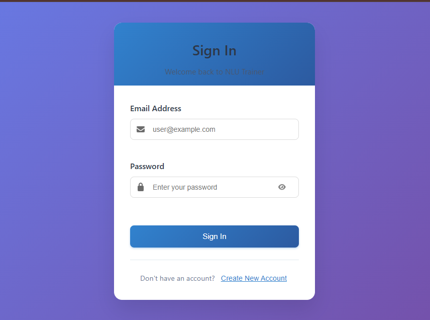
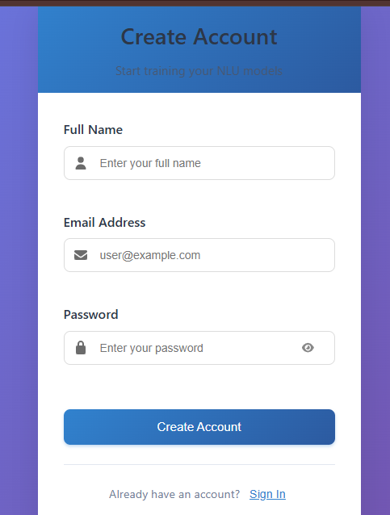

# 🧠 NLU Chatbot & Evaluator

A full-stack **Natural Language Understanding (NLU)** Chatbot project with an **Evaluator module** — designed to manage datasets, annotate text, train AI models, and evaluate chatbot performance.  
Built with **React, Node.js, Express, and MongoDB**.

---

## 🚀 Project Overview

This project allows users to:

- 🧩 Create workspaces for different chatbot projects  
- 📂 Upload datasets in CSV, JSON, or Rasa formats  
- ✏️ Annotate texts with intents and entities  
- 🤖 Train AI models based on annotated data  
- 📊 Evaluate chatbot predictions and performance  
- 📈 View statistics on annotations, intents, and entities  

---

## ⚙️ Features

- **User Authentication:** Signup, login, and profile management  
- **Workspace Management:** Create and manage multiple chatbot projects  
- **Dataset Upload & Management:** Support CSV, JSON, Rasa formats  
- **Annotation Tool:** Annotate text with intents & entities  
- **Model Training:** Train NLU models and simulate AI predictions  
- **Evaluation Module:** View accuracy, precision, recall, and F1-score  
- **Statistics Dashboard:** View annotation, intent, and entity insights  

---

## 🧰 Tech Stack

| Frontend     | Backend            | Database | Tools |
| ------------- | ------------------ | -------- | ------------------------- |
| React + Vite  | Node.js + Express  | MongoDB  | VS Code, Postman, Nodemon |
| Axios         | JWT Authentication | Mongoose ORM | Git, GitHub |

---

## 🏗️ Project Structure

Infosys-Project/
          ├─ backend/
          │  ├─ controllers/
          │  │  ├─ authController.js
          │  │  ├─ annotationController.js
          │  │  ├─ datasetController.js
          │  │  └─ modelController.js
          │  ├─ middleware/
          │  │  └─ auth.js
          │  ├─ models/
          │  │  ├─ Annotation.js
          │  │  ├─ Dataset.js
          │  │  ├─ ModelMeta.js
          │  │  └─ Workspace.js
          │  ├─ routes/
          │  │  ├─ auth.js
          │  │  ├─ annotation.js
          │  │  ├─ dataset.js
          │  │  └─ model.js
          │  ├─ server.js
          │  └─ package.json
          ├─ frontend/
          │  ├─ src/
          │  │  ├─ components/
          │  │  ├─ pages/
          │  │  ├─ App.jsx
          │  │  ├─ main.jsx
          │  │  └─ vite.config.js
          │  └─ package.json
          ├─ screenshots/
          │  ├─ workspace.png
          │  ├─ dataset.png
          │  ├─ annotation.png
          │  ├─ model.png
          │  ├─ testmodel.png
          │  ├─ login.png
          │  └─ signup.png
          └─ README.md
          


---

## 🖼️ Screenshots

### 🧩 Workspace Dashboard


### 📂 Dataset Upload


### ✏️ Annotation Tool


### 🤖 Model Training



### 🧪 Test Model


### 🔐 Authentication Pages



---

## ⚡ Installation

### 🖥️ Backend Setup
```bash
cd backend
npm install
npm run dev

💻 Frontend Setup
cd frontend
npm install
npm run dev


Backend: http://localhost:5050

Frontend: http://localhost:3000
 (Proxy configured to backend)


🧩 Usage

1️⃣ Sign up or log in
2️⃣ Create a workspace for your chatbot project
3️⃣ Upload a dataset (CSV, JSON, or Rasa)
4️⃣ Annotate your dataset with intents & entities
5️⃣ Train the NLU model
6️⃣ Evaluate chatbot predictions and performance
7️⃣ Monitor stats and refine annotations

🧑‍💻 Contributing

Fork the repository

Clone locally

Make your changes and commit

Push to your fork and create a pull request

🪪 License

This project was developed for Infosys Internship / Project Submission.
© 2025 Saloni Mishra
